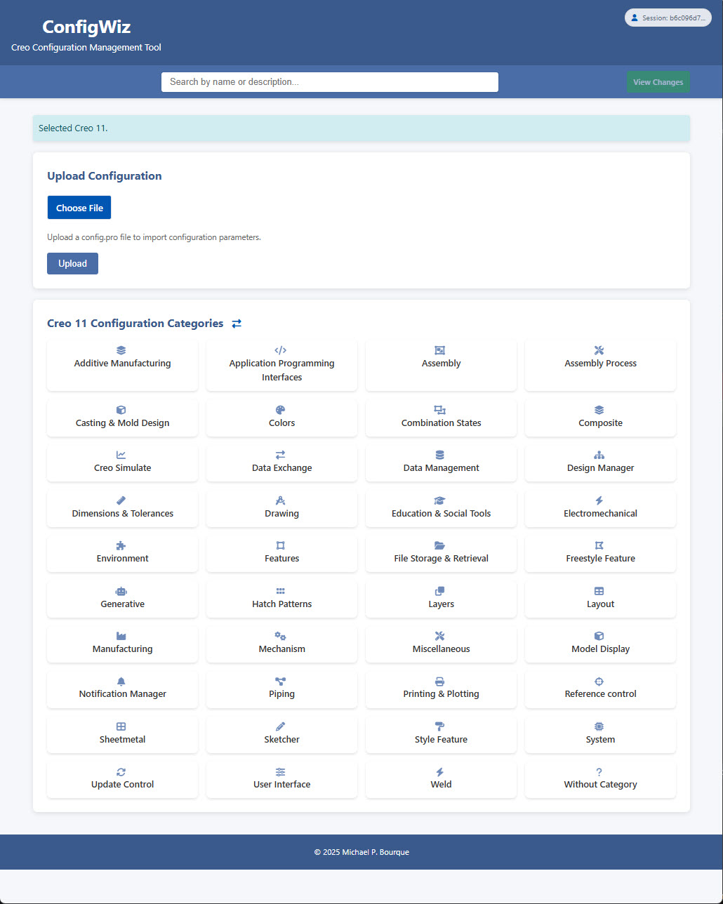

# ConfigWiz

ConfigWiz is a web-based configuration management tool for Creo Parametric, designed to simplify the process of viewing, modifying, and managing configuration parameters across different versions of Creo.

## Features

- **Multi-Version Support**: Seamlessly manage configurations for different Creo versions (2.0 through 11.0)
- **Intuitive Interface**: Easy-to-use web interface for viewing and modifying configuration parameters
- **Smart Search**: Instantly search through thousands of parameters with intelligent matching
- **Custom Parameter Categories**: Access parameters through both standard and custom-defined categories
- **Enhanced Descriptions**: Combines information from multiple sources for comprehensive parameter documentation
- **Parameter Management**:
  - View and modify parameter values
  - Track changes from default values
  - Reset parameters to default values
  - Compare modified parameters with their defaults
  - Highlight and scroll to parameters when navigating from search or summary views
- **Change Tracking**: Keep track of all modifications with clear indications of changed values
- **Validation**: Built-in validation to ensure parameter values are properly formatted
- **Import/Export**: Support for importing existing config.pro files and exporting changes
- **Session Management**: Automatically saves changes to browser session
- **Mobile-Responsive Design**: Works on desktop, tablet, and mobile devices
- **Analytics Integration**: Optional Google Analytics support for tracking usage patterns

## Use it right now!
Hosted on [my website](https://ptcuserboston.org/configwiz)

## Suggestions and Ideas welcome
Please feel free to make suggestions and report issues [here](https://github.com/mbourque/configwiz2/issues): 



## Installation

1. Clone the repository:
```bash
git clone https://github.com/yourusername/configwiz.git
cd configwiz
```

2. Ensure your web server (like Nginx or Apache) is properly configured to serve PHP files from the installation directory.

3. Make sure the following directories are writable by the web server:
```bash
chmod 755 sessions uploads
```

4. Access the application through your web browser:
```
http://your-server/configwiz/
```

## Analytics Configuration (Optional)

ConfigWiz includes optional support for Google Analytics to track usage patterns and improve user experience. To enable or disable analytics:

1. Copy the sample configuration file:
```bash
cp includes/config.sample.php includes/config.php
```

2. Edit `includes/config.php` and set your Google Analytics ID:
```php
$config = [
    'google_analytics_id' => 'YOUR-GA-ID-HERE'  // Set to empty string to disable analytics
];
```

The `config.php` file is ignored by Git to keep your analytics ID private. If you don't want to use Google Analytics, you can either:
- Leave the ID empty in `config.php`
- Don't create the `config.php` file (analytics will be disabled automatically)

## Configuration File Structure

The application uses the following configuration files:

### CSV Configuration Files
Located in the `configs` directory, these files store parameter definitions for each Creo version:

- `creo{version}_configs.csv` - Contains parameters for specific Creo versions
  Format: `Category,Name,Description,Value,Default Value`

### Parameter Metadata
- `parameter_metadata.csv` - Contains additional parameter descriptions and custom category assignments
  Format: `CustomCategory,Name,AdditionalDescription`

## Directory Structure

- `/index.php` - Main application entry point
- `/includes/functions.php` - Core utility functions
- `/configs/` - Creo version-specific configuration files
- `/static/` - Static assets (CSS, JavaScript, images)
  - `/static/css/` - Stylesheet files
  - `/static/js/` - JavaScript files
- `/templates/` - PHP template files for different views
- `/uploads/` - Temporary directory for file uploads
- `/sessions/` - User session data storage (gitignored)

## Technical Details

The application is built with:
- **PHP**: Server-side processing and templating
- **CSV**: Data storage for configuration parameters
- **JavaScript**: Client-side functionality, including:
  - Auto-saving parameter changes
  - Dynamic search functionality
  - Parameter highlighting and navigation
- **CSS**: Custom styling with responsive design
- **JSON**: Session data storage
- **FontAwesome**: Icons for improved user interface

## Browser Support

ConfigWiz works best with modern browsers:
- Chrome (recommended)
- Firefox
- Edge
- Safari

## Contributing

1. Fork the repository
2. Create a feature branch
3. Commit your changes
4. Push to the branch
5. Create a Pull Request

## License

[MIT License](LICENSE)

## Author

Michael P. Bourque - [GitHub Profile](https://github.com/mbourque)

## Acknowledgments

- Special thanks to everyone who contributed to this project
- Inspired by the need for simplified Creo configuration management 
